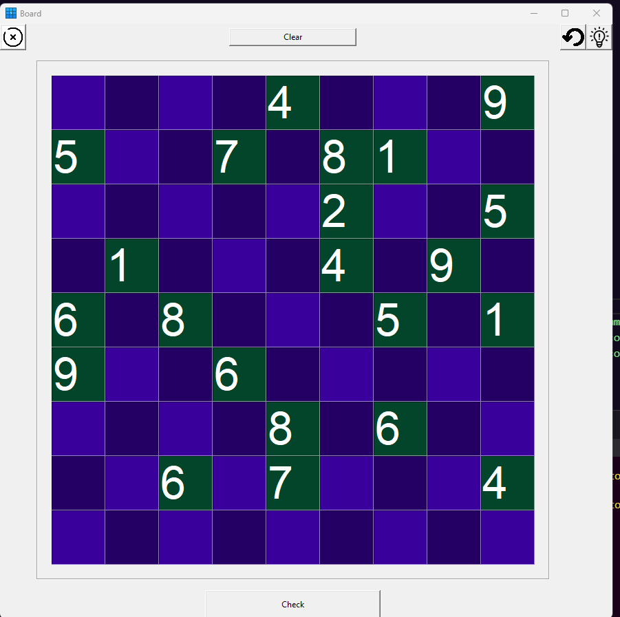
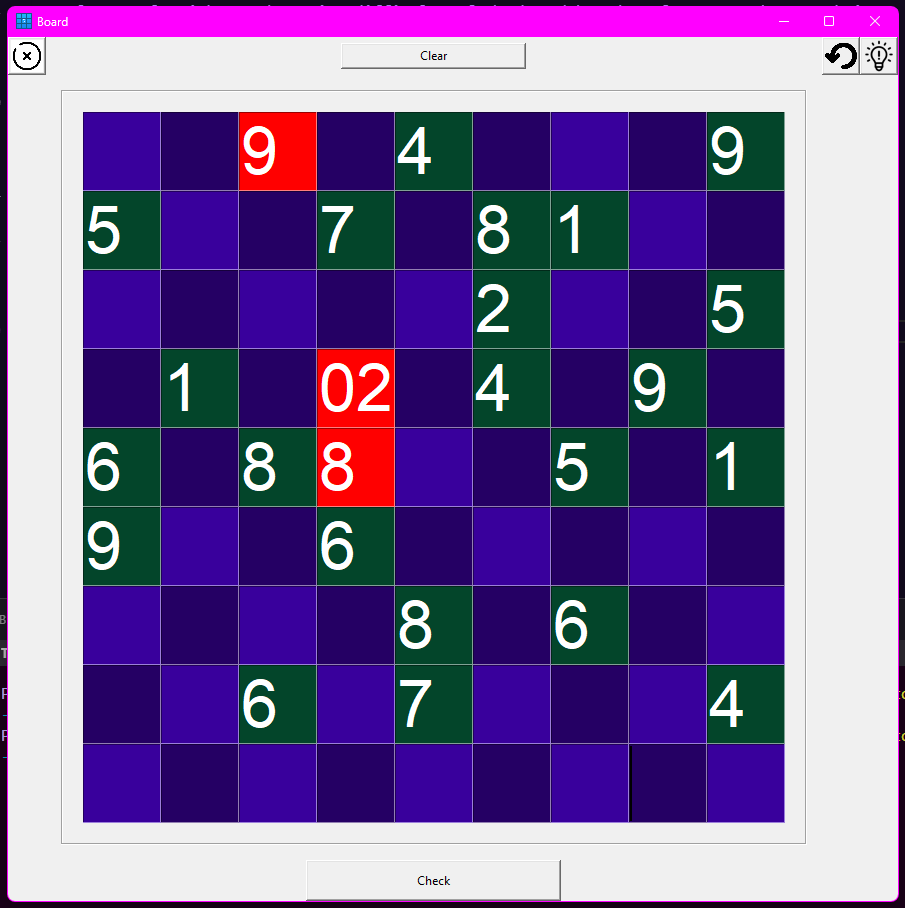
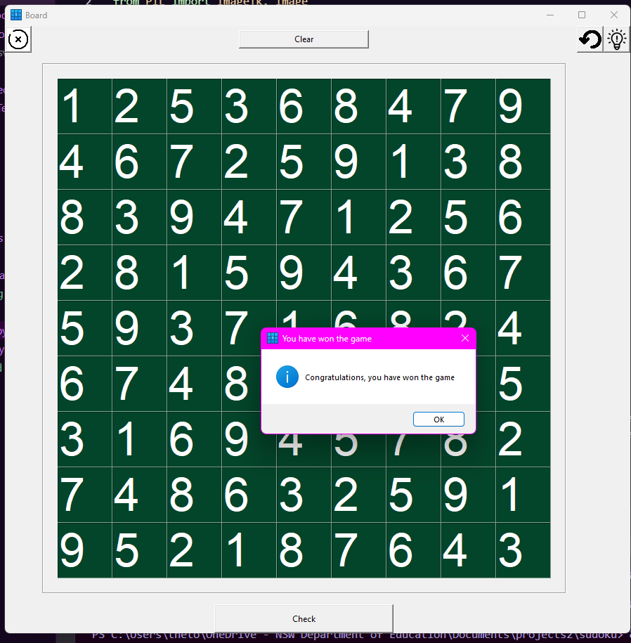

# Sudoku Application

## Overview 

One of the reasons I developed this project was as a way to learn how to do GUI development inside Python. I specifically chose to do Sudoku as it is quite a technical area, and it allows me to use my DSA skills in a way I'm not used to.

Because both generating and solving Sudoku puzzles is NP-complete, it provides interesting optimisation challenges, especially considering this is developed in Python. Another interesting challenge posed by Sudoku is the use of randomness.

The front end is created using TKinter, a python standard library GUI library. The only non-standard library used is PIL, which is a fork of the discontinued standard library Pillow.


## Functionality 
- Solves Sudoku puzzles and ensures there is only one unique solution for each.
- Generates Sudoku boards of varying difficulty using the "Digging" method, puzzles generated will all have exactly one solution.
- Allows users to play Sudoku games, including relevant functionality for that, such as:
    - Undo methods, reversing the last move made.
    - Hints.
    - Checking if solution is valid, and highlighting invalid areas.
- Other development based functionality, including:
    - Converting CSV Sudokus to the input format accepted by the Sudoku solver algorithm.
    - Limited unit tests.

## Future development 
- Expand unit tests to more areas of the code, including tests for developing the base that puzzles will be generated from, and unit tests for the generation of boards themselves.
- Improve user interface.
- Implement algorithm to determine difficulty of the board based on factors such as techniques required to solve, clue amount and clue distribution.
- Improve generation algorithm by including factors such as symmetry and distribution.
- Implement controller class to allow for navigation to main menu from play board.
- Optimise solver algorithm.

## How to play
1. Download the whole project.
2. Ensure PIL (Python image library) is installed ``` pip install pillow ```.
3. Run mainMenu.py


## Screen shots



